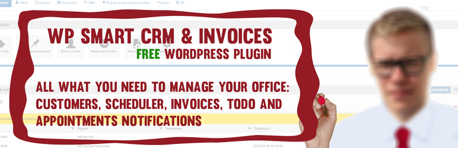

<h2 align="center" style="color:#38c2bb;">📚 PS Smart Business</h2>

<strong>Von CRM zu Smart Business Suite</strong> Kunden, Dokumente, Prozesse, Buchhaltung und Automatisierung in einem Plugin.

  <a href="index.html" style="color:#38c2bb;">🏠 Übersicht</a>
  <a href="dokumentation.html" style="color:#38c2bb;">📝 Dokumentation</a>
  <a href="https://github.com/cp-psource/ps-smart-crm/discussions" style="color:#38c2bb;">💬 Forum</a>
  <a href="https://github.com/Power-Source/ps-smart-crm/releases" style="color:#38c2bb;">⬇️ Releases</a>

## Willkommen in der Suite-Dokumentation

PS Smart Business ist nicht mehr nur ein CRM, sondern eine modulare Business Suite für Classic/ClassicPress. Diese Seite ist dein zentraler Einstieg in Funktionen, Module und den laufenden Ausbau der Doku.

## Schnellstart

1. Plugin aktivieren und Grundeinstellungen prüfen
2. CRM-Agentenrollen und Zugriffe festlegen
3. Kundenimport und erste Prozesse (Aufgaben/Termine) starten
4. Dokumenten- und Rechnungsworkflows konfigurieren
5. Integrationen und Buchhaltungsmodule verbinden

## Produktbereiche im Überblick

### CRM & Kundenmanagement

- Kundenarchiv mit Grid-Ansicht
- Agentenrollen und interne Workflows
- TODO-/Terminplanung und Statusverfolgung
- Timeline und Notizverwaltung
- Regelbasierte Benachrichtigungen

### Dokumente & Angebote

- Dynamische Erstellung von Angeboten und Rechnungen
- PDF-Ausgabe, Download und Serverablage
- Signatur-Workflows (Canvas, touchfähig)
- Zahlungsfristen, Erinnerungen und interne Kommentare

### Buchhaltung & Umsatztracking

- Rechnungserfassung und Nummernlogik
- Anbindung externer Plugin-Umsätze
- Struktur für erweiterbare Buchhaltungsprozesse

### Frontend, PWA & Integrationen

- PWA-Bausteine für app-nahe Nutzung
- Frontend-Module für kundennahe Interaktionen
- Integrationspunkte für Drittplugins und eigene Erweiterungen

## Dokumentations-Startpunkte

- [Projektüberblick](README.html)
- [Allgemeine Dokumentation](dokumentation.html)
- [Einrichtung & Berechtigungen](einrichtung-berechtigungen.html)
- [CRM & Prozessmanagement](crm-prozessmanagement.html)
- [Dokumente, Angebote & Rechnungen](dokumente-rechnungen.html)
- [Buchhaltung & Abrechnung](buchhaltung-abrechnung.html)
- [Integrationen, API & Erweiterbarkeit](integrationen-api-erweiterbarkeit.html)
- [Dev-Referenz: Integrationen, Hooks & Actions](dev-hooks-actions.html)
- [PWA & Frontend-Module](pwa-frontend-module.html)
- [WebApp-Funktion (PWA/App-Modus)](webapp-funktion.html)
- [Über das Projekt](about.html)
- [GitHub Discussions](https://github.com/cp-psource/ps-smart-crm/discussions)
- [Releases / Changelog](https://github.com/Power-Source/ps-smart-crm/releases)

## Doku-Roadmap (Start)

Die Dokumentation wird ab jetzt schrittweise entlang der Suite-Module aufgebaut:

- [Einrichtung & Berechtigungen](einrichtung-berechtigungen.html)
- [Kunden- und Prozessmanagement](crm-prozessmanagement.html)
- [Dokumente, Angebote, Rechnungen](dokumente-rechnungen.html)
- [Buchhaltung & Abrechnung](buchhaltung-abrechnung.html)
- [Integrationen, API, Erweiterbarkeit](integrationen-api-erweiterbarkeit.html)
- [Dev-Referenz: Integrationen, Hooks & Actions](dev-hooks-actions.html)
- [PWA- und Frontend-Bausteine](pwa-frontend-module.html)
- [WebApp-Funktion (PWA/App-Modus)](webapp-funktion.html)

## Mitwirken

Feedback, Fragen und Verbesserungsvorschläge sind willkommen. Nutze das Forum/Discussions, um Anforderungen, Workflows und Best Practices zu teilen.

Wenn du Übersetzungen anpasst, lege eigene `.mo/.po` Dateien bitte unter `/wp-content/languages/plugins` ab, damit sie bei Updates nicht überschrieben werden.

---

## Seiten-Navigation

<a href="about.html">⬅️ Zurück</a> · <a href="index.html">🏠 Übersicht</a> · <a href="einrichtung-berechtigungen.html">Weiter ➡️</a>

